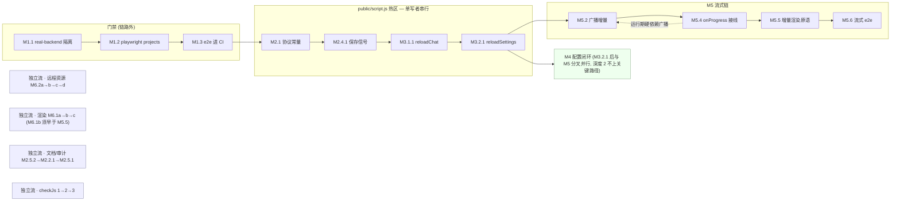

# SillyTavern Modern Workspace — 发展目标与迭代路线

> 规划日期：2026-07-17 · 基于全仓多智能体分析（6 份子系统解读 + 3 份视角提案 + 交叉评审）+ 两轮对照仓库代码的对抗性核查修订
> 适用对象：单人维护者（AI 辅助高速开发模式）

## 0. 一句话总纲

功能扩张期已经结束；未来 6–12 个月的主题是**「可信化」**——先装 CI 护栏，再把 legacy bridge 从隐式契约改造成可信管道，补齐流式输出这一最大体验差距，并把例行维护成本压到每月半天以内。

## 1. 仓库定位与现状判断

**定位**：单人自用的 AI 角色扮演工作台。上游 SillyTavern 1.18.0（2026-05-03 基点 51ad27fb8）的 fork，核心资产是自研 Modern Workspace 前端（约 2 万行无构建 ESM、13 个 route）、隐藏 iframe legacy bridge 生成链路、35 个 provider 的远程资源聚合器（以 provider-registry.js 为准；README 记 34 有口径差）、一条后端安全加固系列和约 1.09 万行三层 e2e。

**阶段判断**：2026-07-01 ~ 07-17 的 17 天里压入 405 个 commit（feat→refactor→test→fix 的典型冲刺曲线），近期提交均为竞态、滚动、未读语义类打磨级修复——主干功能已稳定，处于冲刺期收尾。对单人自用而言，**功能面已经够了**，继续横向铺功能的边际收益低于纵向把已有链路做可信。

**三条信任裂缝**（未来规划的直接动因）：

1. **Bridge 状态漂移**：iframe 启动时一次性快照 settings/角色卡，此后 modern 侧换预设、改角色卡、编辑消息均不传导进生成引擎；且旧引擎 `saveSettingsDebounced`（41 个文件、712 处调用）会把 iframe 内陈旧全量 settings 反写回后端，静默回滚 modern 刚保存的配置。
2. **Bridge 失败路径黑洞**：modern 编辑消息后再生成触发 saveChat 完整性冲突，旧引擎的确认弹窗在隐藏 iframe 中永远无人应答（挂死 180s 且丢回复）；`toastr.error` 型静默失败被 continue/regenerate/swipe 当成成功。
3. **护栏缺失**：1.09 万行 modern e2e 完全不进 CI（pr-checks.yml 只有 ESLint + 单测）；real-backend 套件直接读写真实 `data/default-user` 目录且无 opt-in 环境门；上游脱钩 2.5 个月且未配 upstream remote，安全修复零感知。

## 2. 北极星与发展目标（6–12 个月）

**北极星：日常使用零摩擦、任何改动有护栏、维护成本随时间递减。**

可观察的北极星信号（含度量口径）：

- **连续 30 天不手动打开隐藏旧页**——隐藏 iframe 恒带 `?modernBridge=1`，用既有 access log 中不带该参数的 `/index.html` 请求区分手动打开，查询写进月度巡检 SOP；
- **合入 master 的每个改动都经过 CI e2e 门禁**——PR checks 状态即口径；
- **每月例行维护 ≤ 半天**——MAINTENANCE.md 巡检记录模板带「实际耗时」字段，前两个月实测校准；CI e2e 偶发 flake 的处置显式计入该预算。

### G1 可信生成管道

**目标**：bridge 从「靠冻结上游保护的隐式契约」变成「有共享协议定义、失败可感知、状态可同步的可信管道」。

**验收标准**：
- 挂死 180s、静默失败当成功、settings 静默回滚三个场景归零；
- 协议（source 标识、action 名、字段、超时档位）收敛为双侧 import 同一份常量模块；
- modern 侧改 settings/预设/角色卡/消息后，生成引擎即时可见（reload 通道）；
- headless e2e 覆盖逐 action 往返 + 错误形态 + 「生成全程 settings 端点零写入」断言；
- 「生成期间旧引擎实际回写字段清单 + 白名单」审计表落入 MAINTENANCE.md。

### G2 自动回归门禁

**目标**：单人高速开发装上自动安全网，回归从「靠手动跑 README 流程」变成「PR 必过」。

**验收标准**：
- mock 路由层 modern e2e + bridge headless 进 PR 门禁；
- real-backend 套件针对临时 dataRoot 的专用 server 实例运行，并以 playwright projects/testIgnore 从默认执行入口排除（opt-in 落成配置而非约定）；
- 测试前后对 `data/default-user` 与 `public/scripts/extensions/third-party`（全局扩展目录不随 dataRoot 走）做递归 checksum 快照比对为零差异；
- 失养的 tests/frontend/ Macro* 套件从默认 testMatch 排除（不删文件）；external 外部依赖测试保持环境变量 opt-in。

### G3 体验补齐——「不再想开旧页」

**目标**：把日常使用中仍需绕道隐藏 legacy 页的高频动作全部收进 modern。

**验收标准**：
- 聊天文本生成有流式输出（token 级增量渲染；reasoning 流与工具调用期间的展示明确排除在外，归入逃生门）；
- PromptManager 排序/开关、instruct/context/sysprompt 模板激活可在 modern 内操作；
- 全部 legacy 配置项经带快照保护的 raw settings 编辑器可改且改完即生效；
- 消息渲染语义与 legacy showdown 对齐，消息区 XSS 防线交给 DOMPurify。

### G4 低成本长期存活

**目标**：仓库以最低维护成本长期存活，决策与债务显性化，防止未来的自己（或 AI 助手）重新掉进反目标。

**验收标准**：
- MAINTENANCE.md 落地：冻结基线、已改共享文件台账、冻结面、巡检节奏（含耗时记录）、已知债务及不修理由、不做清单、**data/ 备份口径**（明确依赖机器级备份如 Time Machine，或月度 rsync 到仓库外——chat backups 与 settings snapshot 都落在 data/ 内部，目录级损坏时同归于尽，单人自用数据不可再生，必须显性决策）；
- upstream remote 配置（只 fetch），月度过一遍上游安全类 commit，仅后端共享面定点 cherry-pick；
- remote-resources provider 具备用户级 enabled 开关（坏了一键关，不修长尾）；
- public/modern/core/ 与 shell/ 纳入 checkJs（渐进推开）。

### 非目标（锚定既定决策，规划期内不重议）

- 移动端/响应式适配（长期搁置）；
- legacy P4/P5 删除清理（软下线保留文件是 bridge 的运行时依赖）；
- 摘除 bridge / 重写生成引擎（约 4.7 万行深度纠缠 DOM 的核心，单人不可维护）；
- 上游全量 rebase/merge（只定点 cherry-pick 安全修复）；
- 引入前端框架/构建工具链（无构建 ESM 是已验证资产，迁移作废 1.09 万行 e2e）；
- 多用户/公网部署安全强化（单机自用威胁模型不成立，保持不公网 listen 纪律）；
- slash commands/STscript、扩展运行时 UI 框架整体移植（逃生门：按需打开隐藏旧页）。

## 3. 迭代路线

依赖主线：**M1（门禁）→ M2（止血+契约化）→ M3（同步通道）→ M4（配置闭环）→ M5（流式）→ M6（渲染与消耗品收尾）**；S 级杂项（M2.5）穿插不占主线。

排序依据：M1 无任何前置依赖、量级最小、且保护其后所有改动（M2 起就要动 13k 行 public/script.js 的生成链路核心路径），故先行；三个丢数据场景在 M1 完成前通过行为规避（避免「编辑消息后立即再生成」、重要配置改完手动确认一次）过渡，代价是已知问题多存活几天。M5 刻意排在 M2/M3 之后：流式是对协议的纯增量扩展，必须在协议契约化且 CI 就位后做。

量级参照本仓库已验证的 AI 辅助开发速度：S ≈ 半天–1 天，M ≈ 1–3 天集中投入，L ≈ 4–7 天。

### M1 · 回归门禁（近期，量级 M）

**目标**：G2 全量达成，为后续一切改动装上安全网。

**内容**（严格按序，第 1 步是后两步的前置）：
1. real-backend 套件改为针对临时 dataRoot 启动的专用 server 实例（`--dataRoot` 参数已支持，见 src/command-line.js）；同步解决全局扩展目录隔离盲区——`public/scripts/extensions/third-party` 硬编码于 src/constants.js 不随 dataRoot 走，real-backend 的「move to global」用例需改用临时 serverDirectory 或将该目录纳入快照验收；
2. tests/playwright.config.js 加 webServer/globalSetup 自动拉起 server；用 **projects 分组**落实分层执行：mock 路由级 + bridge headless 为默认 project，real-backend、external 各自独立 project 仅显式 `--project` 触发（external 保留既有 `MODERN_EXTERNAL_E2E=1` 门，real-backend 补同款环境门）；tests/frontend/ 加 README 说明失养状态；清理 tests/tests/test-results/ 误嵌套残留；
3. .github/workflows/pr-checks.yml 新增 e2e job（默认 project，--workers=1）；real-backend 可选 nightly。

**退出标准**：PR 触发的 CI 包含 e2e 且全绿；跑完整测试前后对 `data/default-user` 与全局扩展目录做递归 checksum 快照，比对零差异（注意：`/data` 在 .gitignore 中，`git status` 不可作为判据）。

### M2 · Bridge 止血 + 协议契约化（近期，量级 M+M）

**目标**：三个丢数据/失效场景归零；协议从两侧各写一份字符串变成共享定义。

**内容**：
1. 先行小步：抽双侧可 import 的 bridge 协议常量模块（source 标识、6 个 action 名、消息字段、超时档位），public/script.js 与 public/modern/core/legacy-bridge.js 改为引用同一份；
2. **settings 反写审计（独立交付物）**：梳理生成会话期间旧引擎实际回写的 settings 字段（`saveSettingsDebounced` 分布在 41 个文件、712 处调用，重点筛生成链路触达的子集），产出「回写字段清单 + 白名单」表格写入 MAINTENANCE.md；据此在 bridge 模式下短路或按白名单收窄反写；
3. public/script.js 的 saveChat 完整性冲突与 Popup 交互路径加 `isModernBridgeMode` 特判（全文件现仅 3 处该判断，改动集中），改为 postMessage 回传结构化错误；关键 `toastr.error` 静默失败点桥接为 RPC error；
4. 保存结果校验（跨两侧）：legacy 侧 generate/swipe handler 采集 `saveChatPersistenceContext` 返回值放入 bridge result（如 `saved: boolean`），modern 侧 actions/chat-generation.js 校验该字段——continue/regenerate/swipe 不改变消息数，normal 已有的 messageCount 校验机制对它们天然失效，必须走保存信号而非消息数类比。

**退出标准**：tests/modern-bridge-headless.e2e.js 新增「生成全程 settings 端点零写入」与失败形态断言并经 CI 通过；手动复现三个场景均得到可感知错误而非挂死/静默；审计表落入 MAINTENANCE.md。

### M2.5 · 决策文字化与上游巡检（穿插，量级 S）

**内容**：`git remote add upstream`（只 fetch）；新增 MAINTENANCE.md（冻结基线 1.18.0/51ad27fb8、已改共享文件清单、冻结面、月度巡检 SOP 含耗时记录字段、已知债务、不做清单、data/ 备份口径）；当前稳定点打 tag（如 `v1.18.0-mw.1`），此后每个里程碑收尾打 tag。

**退出标准**：文档合入；第一次上游安全巡检执行完毕并记录结论与实际耗时。

### M3 · Bridge 同步通道（近期，量级 M）

**目标**：根治「改了不生效」，G1 全量达成。

**内容**：public/script.js 的 modernBridge 分发区实现三个 reload handler——`reloadChat`/`reloadCharacter` 复用既有 getCharacters/openCharacterChat/openGroupChat（已在 bridge 上下文被 useModernBridgeChatContext 实际使用过，可行性已验证）；`reloadSettings` **不可整体复用 getSettings**（该函数按一次性启动设计：initMacros 会重复注册事件监听、重放 SETTINGS_LOADED 系列一次性事件），需从中拆出可重入的「settings 应用」子集，跳过一次性初始化路径。modern 侧在 settings/presets/personas/character-detail 保存成功及 chat 消息编辑/删除后触发对应 reload；headless e2e 扩为逐 action 往返 + 错误形态契约测试；MODERN_UI_ARCHITECTURE.md 补协议章节。

**退出标准**：modern 改预设/改角色卡/编辑消息后，无需刷新页面即可正确生成；编辑消息后再生成不再触发完整性冲突；连续多次 reloadSettings 无监听器/扩展状态累积（幂等断言）。

### M4 · 配置闭环（中期，量级 M+M）

**目标**：高频调参动作全部收进 modern，配置盲区永久关闭。

**内容**：
1. 带快照保护的 raw settings 编辑器：复用 preset-details 已有的原始 JSON 编辑器组件模式；写入走既有 SerialTaskQueue；保存前自动创建 settings 快照；保存成功触发 reloadSettings（依赖 M3）；
2. 生成相关配置表单化：prompt_order 开关/排序编辑、instruct/context/sysprompt/reasoning 模板激活切换，沿现有「按 API 分组 + 表单/raw 双模式」设计演进；范围以实际使用盘点为准，不复刻完整 PromptManager。

**退出标准**：日常调参（换模型、调 prompt 顺序、切模板、改任意 power_user 项）全程不离开 modern；每项接入 reloadSettings 并有 mock 层 e2e。

### M5 · 流式输出 + chat 增量渲染（中期，量级 L，最大单项）

**目标**：补齐与 legacy 最大的可感知体验差距，并顺带在最高频页面建立增量渲染原语。

**内容**：协议常量模块增加单向 progress/token 事件类型；legacy 侧**订阅既有事件总线 `STREAM_TOKEN_RECEIVED`**（public/script.js 每 token 均 emit，优于在 StreamingProcessor 内部插桩，符合「不新造链路」原则）按 contextKey postMessage 增量文本（复用既有 contextKey 守卫做 stale 丢弃）；legacy-bridge.js 支持事件订阅；chat-generation.js + chat-message-content.js 渲染流式气泡，走定点 DOM 更新绕过全量重渲染；mock 事件补流式 e2e；本地 mock LLM server 补 SSE 契约用例（填补流式链路零测试盲区）。

**退出标准**：文本生成期间 token 级增量显示，停止/切换上下文时 stale 内容正确丢弃；reasoning 流与工具调用期间维持现状（状态文案），显式不在范围内；CI 门禁全绿；流式路径有自动化用例。

### M6 · 渲染对齐 + 远程资源收尾（中期，量级 M+M）

**内容**：
1. 消息渲染改用 legacy 已 vendor 的 showdown + DOMPurify 白名单输出（同时解决渲染语义不一致与手写 escapeHtml 防线问题）；补渲染与注入向量断言；
2. remote-resources 降级为可关断消耗品：35 家 provider 的用户级 enabled 开关 + 前端透出；preset 本地导入链路（当前 5 家 preset provider 只能落浏览器下载）——注意两个前置子项：/api/presets/save 按 apiId 分目录落盘，远端 preset JSON 无 apiId 标注，需推断或用户选择；risu-realm 的 'preset-risu-v1' 非 ST 原生格式，需转换或明确排除；imports.json 按已存 remoteId/sourceUrl 渲染「已导入」徽章。

**退出标准**：RP 文本（斜体/引号/代码块）渲染与 legacy 一致；任一 provider 失效可在 UI 一键禁用；ST 原生格式 preset 一键导入（非原生格式的处理策略已明确记录）。

### 背景慢火项（远期，随日常改动推进，不设截止）

- **checkJs 渐进**：jsconfig.json 先对 public/modern/core/ 与 shell/ 开启，补状态树/api-client/bridge 协议/route-context 的 JSDoc typedef，`tsc --noEmit` 进 CI；actions/components 随日常改动覆盖（S）；
- **生成可观察性**：bridge 加只读 action 返回最近一次生成的 itemized prompt 分解与 token 统计，inspector 的 chat section 展示（M，依赖 M2 契约化）；
- **chat 渲染收尾**：scroll/focus 保存恢复收敛为 shell 层单一原语；unread diff 从全量 `JSON.stringify` 比对改为 per-chat 游标比对（M，依赖 M5 建立的增量渲染基础，个人数据规模下不紧急）。

## 4. 节奏与工作方式

- **master 单线 + 里程碑 tag**：不引入发布分支/CHANGELOG/正式版本流程；每个里程碑收尾打 tag 作为回退锚点；
- **每迭代验证清单**：`git diff --check` → ESLint → 最近的 modern e2e 文件 → 触及共享路由/状态/API/chat 时跑 real-backend 或完整 modern e2e（M1 后由 CI 承担默认层）；
- **月度维护例行**（M2.5 后生效，目标 ≤ 半天，记录实际耗时校准）：上游 security/fix commit 过目（仅 src/endpoints/、src/middleware/、src/*.js 共享面评估 cherry-pick）→ `npm audit` 只吃安全补丁 → access log 查北极星信号 1 → 按需跑 external 巡检看 provider 存活 → data/ 备份口径核查；
- **文档随行**：route 归属、入口行为、provider 注册、测试责任变化时同步 README 与 MODERN_UI_ARCHITECTURE.md（既有规则延续）。

## 5. 风险登记

| 风险 | 影响 | 缓解 |
| --- | --- | --- |
| legacy 侧改动静默破坏 bridge 契约 | 生成链路整体失效 | M2 协议常量化 + headless 契约测试；MAINTENANCE.md 声明冻结面 |
| settings 反写审计遗漏依赖字段 | 禁反写后生成行为异常 | M2 审计独立成交付物（字段清单+白名单入 MAINTENANCE.md），白名单而非一刀切；headless e2e 断言护航 |
| M1 前窗口期三个丢数据场景仍活跃 | 偶发挂死/配置回滚 | 行为规避（不在编辑后立即再生成；重要配置改完确认）；M1 仅 M 级，窗口期短 |
| 全量 innerHTML 重渲染的滚动/焦点回归 | 高频页面体验损伤 | 新增可滚动区域必配保存/恢复；M5 起增量渲染逐步替代；远期统一原语 |
| CI e2e 偶发 flake 侵蚀信任与预算 | 门禁被绕过或维护超时 | flake 处置计入月度预算；连续 flake 的用例降级修复而非重试掩盖 |
| 上游安全漏洞无感知 | 后端共享面暴露 | M2.5 upstream 巡检机制；月度 npm audit |
| 35 家 provider 第三方站点改版/封禁 | 单 provider 失效 | M6 enabled 开关，定位为可关断消耗品，不修长尾 |
| data/ 目录级损坏（备份都在其内部） | 不可再生数据全失 | M2.5 起 MAINTENANCE.md 显性化备份口径（机器级备份或月度 rsync 出仓） |
| 17 天冲刺遗留长尾缺陷 | 偶发数据一致性问题 | 不专项扫雷；靠 CI 门禁 + 日常使用暴露后按 fix 波次消化 |

## 6. 完整不做清单

1. 不做移动端/响应式适配（既定决策；860px 断点维持现状）；
2. 不做 legacy P4/P5 删除清理；失养测试套件只从执行入口排除、不删文件；
3. 不摘除 bridge、不重写生成引擎；
4. 不做上游全量 rebase/merge；前端与功能类更新一律不追；
5. 不引入前端框架、构建工具链、虚拟 DOM、TS 编译产物；
6. 不为 remote-resources 建自动健康监控/自动禁用/退避/结果缓存；不治理硬编码第三方凭据（碎了再修）；不为 35 家 provider 补 fixture 全覆盖；
7. 不为多用户/公网部署做安全强化排期（部署前提改变时另立专项）；
8. 不移植 slash commands/STscript、扩展运行时 UI 框架，不承接 impersonate/checkpoint/BulkEdit 等 legacy 深水区；
9. 不把 real-backend 与 external e2e 塞进 PR 门禁（分层用 playwright projects 落成配置）；
10. 不做资源级深链接/浏览器历史体系；
11. 不追求测试覆盖率数字；测试投资只对准 bridge 契约、chat 渲染/并发语义、（按需）provider 解析层三个回归高发面；
12. 不大规模升级工具链（ESLint 9、Jest 30、Node 大版本）；锁版本，安全问题逼迫时才升且必须过 CI；
13. 不引入正式发布流程；
14. 不做未显形的性能优化（unread diff 与 chat 渲染收尾已列入背景项，其余等真实卡顿出现再议）。

---

# 执行计划（并行拆解）

> 在第 3 节的里程碑之上，把 M1–M6 + 背景项拆成 44 个原子任务，标注硬依赖、文件触碰集、门禁要求，据此给出真实依赖 DAG、文件冲突热区、执行波次与可并行的 AI agent 批次。基于实际读代码得到的文件+行号触碰集，并经一轮对照代码的并行安全性验证修订。

## 7. 怎么读这份计划

- **第 3 节的 M1→M6 是优先级顺序，不是依赖顺序**。真实依赖图里有几条彼此独立的战线，一旦 CI 门禁（M1）与协议常量（M2.1）就位，就能并行推进。
- **能否并行的真正约束 = 是否触碰同一文件/同一函数区域**，而非里程碑归属。最强瓶颈是 `public/script.js` 的 modernBridge 热区（约 5915–6126 行）：M2.1/M2.4.1/M2.3/M3.1.1/M3.2.1/M5.2/BG1 全都改这一段，**强制单写者串行，加 agent 也压不动**。
- **门禁先行是政策约束，不是代码依赖**：改动生成链路核心（`needsGate=true` 的任务）必须在 M1.3 的 CI e2e 门禁变绿之后再**合入 master**；门禁就绪前只做链路外的任务，生成链路 bug 靠行为规避过渡。
- 量级：S≈0.75 天、M≈2 天、L≈5.5 天（AI 辅助工作日）。

## 8. 依赖 DAG 与关键路径

关键路径（最长硬依赖链，11 节点，决定最短总工期）：

**关键路径为何是这个长度**：不由算力决定，而由两个「单写者瓶颈」+ 流式深度决定——(1) script.js 热区 7 个任务强制串行；(2) 政策门（门禁先于生产改动、协议契约先于事件通道、M5 流式在 M2/M3 之后）是 DAG 之外的排序约束，同样把热区钉成一条线。可压缩的部分全在链外。

## 9. 原子任务分解

硬依赖列为空表示无前置。门禁列 = 是否需 M1.3 就绪后才合入 master。

### M1 回归门禁（链路外，最先做）

| 任务 | 说明 | 硬依赖 | 关键文件/区域 | 门禁 | 量级 |
| --- | --- | --- | --- | --- | --- |
| M1.1 | real-backend 套件改临时 dataRoot 专用 server 实例；全局扩展目录走快照校验+用例自清理 | — | tests/modern-real-backend-integration.e2e.js（L10-17 路径常量参数化+spawn server） | 否 | L |
| M1.2 | playwright.config.js projects 分组（default/real-backend/external）+ webServer 自动拉起 + testIgnore 排除 frontend/Macro* | M1.1 | tests/playwright.config.js（整体重写） | 否 | M |
| M1.2b | frontend 失养套件 README + 清理 tests/tests/test-results 误嵌套残留 | — | tests/frontend/README.md（新建）、tests/tests/test-results/ | 否 | S |
| M1.3 | pr-checks.yml 新增 run-e2e job（--project=default --workers=1） | M1.2 | .github/workflows/pr-checks.yml（jobs 区） | 否 | M |

### 文档/运维流 + checkJs（半独立，链路外）

| 任务 | 说明 | 硬依赖 | 关键文件/区域 | 门禁 | 量级 |
| --- | --- | --- | --- | --- | --- |
| M2.5.2 | 新增 MAINTENANCE.md 骨架（冻结基线/共享文件台账/巡检 SOP/不做清单/data 备份口径） | — | MAINTENANCE.md（新建） | 否 | M |
| M2.2.1 | 生成会话期 settings 反写字段审计（只读分析→写审计表） | M2.5.2 | public/script.js（只读 8561-8630 等）、MAINTENANCE.md（append） | 否 | M |
| M2.5.1 | 配置 upstream remote（只 fetch）+ 首次上游安全巡检记录 | M2.5.2 | MAINTENANCE.md（append）、git remote ops | 否 | S |
| M2.5.3 | 当前稳定点打里程碑 tag（v1.18.0-mw.1），约定此后每里程碑打 tag | — | git tag | 否 | S |
| checkJs.1 | 建 public/modern/tsconfig.json（core/**+shell/** checkJs）+ package.json typecheck 脚本 | — | public/modern/tsconfig.json（新建）、package.json | 否 | S |
| checkJs.2 | 补 core/shell 关键模块 JSDoc typedef 至 tsc 通过 | checkJs.1 | core/state.js、api-client.js、legacy-bridge.js、constants.js、shell/* | 是 | L |
| checkJs.3 | pr-checks.yml 新增 run-typecheck job | checkJs.1 | .github/workflows/pr-checks.yml（jobs 区，须晚于 M1.3） | 否 | S |

### M2 Bridge 止血 + 契约化

| 任务 | 说明 | 硬依赖 | 关键文件/区域 | 门禁 | 量级 |
| --- | --- | --- | --- | --- | --- |
| **M2.1** | 抽双侧共享 bridge 协议常量模块（source/action/字段/超时），legacy 与 modern 双侧引用 | — | **public/modern/core/bridge-protocol.js（新建）**、script.js（5915/6069-6126 热区）、legacy-bridge.js（1/8-9）、chat-generation.js（114/166/221/395） | 是 | M |
| M2.2.2 | bridge 模式 settings 反写短路/白名单收窄 | M2.2.1 | script.js（saveSettings 8561-8630） | 是 | S |
| M2.3 | saveChat 完整性冲突 Popup 特判 + 关键 toastr 静默失败桥接为 RPC error | M2.1 | script.js（7963-7990/5768/5886/6122/8628 热区） | 是 | M |
| M2.4.1 | legacy 侧 generate/swipe handler 采集保存信号放入 bridge result（saved 字段） | M2.1 | script.js（handleModernBridgeGenerate 6022-6030 / swipe 6045-6054 热区） | 是 | M |
| M2.4.2 | modern 侧校验 bridge result 的 saved 字段 | M2.4.1 | chat-generation.js（166-186/221-240） | 否 | S |
| M2.6 | headless e2e 补 settings 端点零写入与失败形态断言 | M2.2.2, M2.3, M2.4.1 | tests/modern-bridge-headless.e2e.js | 否 | M |

### M3 同步通道

| 任务 | 说明 | 硬依赖 | 关键文件/区域 | 门禁 | 量级 |
| --- | --- | --- | --- | --- | --- |
| M3.1.1 | legacy 侧 reloadChat/reloadCharacter handler + dispatch 分支 | M2.1 | script.js（dispatch 区 5915-6126 热区） | 是 | M |
| M3.1.2 | modern 侧 chat 消息编辑/删除后触发 reloadChat | M3.1.1 | chat-messages.js、chat-action-registry.js（96-108） | 是 | S |
| M3.1.3 | modern 侧角色卡编辑后触发 reloadCharacter | M3.1.1 | characters.js（81-91）、action-registry.js（137-144） | 是 | S |
| **M3.2.1** | legacy 侧 getSettings 拆出可重入 applyLoadedSettings + reloadSettings handler | M2.1 | script.js（getSettings 8423-8558 + dispatch 热区；紧邻 saveSettings 8561） | 是 | M |
| M3.2.2 | modern 侧设置快照恢复后触发 reloadSettings | M3.2.1 | settings.js（62-79）、action-registry.js（162-173） | 是 | S |
| M3.2.3 | modern 侧预设保存/切换/删除/导入后触发 reloadSettings | M3.2.1 | presets.js（7 个写函数）、action-registry.js（62-73） | 是 | M |
| M3.2.4 | modern 侧 persona 保存/设默认/删除后触发 reloadSettings | M3.2.1 | personas.js、action-registry.js（175-181） | 是 | S |
| M3.e2e | headless e2e：逐 action reload 往返 + 幂等 + 错误形态 | M3.1.1, M3.2.1, M1.3 | tests/modern-bridge-headless.e2e.js | 否 | M |

### M4 配置闭环（M3.2.1 后与 M5 分叉并行）

| 任务 | 说明 | 硬依赖 | 关键文件/区域 | 门禁 | 量级 |
| --- | --- | --- | --- | --- | --- |
| M4.1.1 | raw settings 编辑器：state + 带快照保护的读写 action | M3.2.1, M3.2.2 | settings.js、core/state.js | 是 | M |
| M4.1.2 | raw settings 编辑器：组件 + 路由事件 + 新 section | M4.1.1 | components/settings.js、routes/settings-events.js | 是 | M |
| M4.2.1 | prompt_order 排序/开关编辑：action 层 | M3.2.1, M3.2.3 | presets.js、openai-preset-fields.js | 是 | M |
| M4.2.2 | prompt_order UI + instruct/context/sysprompt/reasoning 模板激活 | M4.2.1, M3.2.1 | components/preset-details.js、routes/presets-events.js、presets.js | 是 | L |

### M5 流式输出（关键路径尾段）

| 任务 | 说明 | 硬依赖 | 关键文件/区域 | 门禁 | 量级 |
| --- | --- | --- | --- | --- | --- |
| M5.1 | 协议常量模块新增单向 progress/token 事件类型 | M2.1 | bridge-protocol.js（additive） | 否 | S |
| M5.2 | legacy 侧订阅 STREAM_TOKEN_RECEIVED 并按 contextKey 广播增量 | M5.1 | script.js（dispatch 热区；emit ~4188 只读） | 是 | M |
| M5.3 | legacy-bridge.js 支持单向 progress 事件订阅 | M5.1 | core/legacy-bridge.js（18-35/111-114） | 是 | M |
| M5.4 | chat-generation.js 流式气泡状态 + onProgress 接线 | M5.3（+运行期硬依赖 M5.2 广播） | chat-generation.js（140-193）、state.js、app.js（52） | 是 | L |
| M5.5 | chat-message 流式气泡渲染原语（定点 DOM 更新） | M5.4（+软前置 M6.1b） | components/chat-message.js（42-118） | 是 | M |
| M5.6 | 流式 e2e + 本地 mock LLM SSE 契约用例 | M5.5 | tests/modern-bridge-headless.e2e.js、tests/util/* | 否 | M |

### M6 渲染对齐 + 远程资源（两条独立流）

| 任务 | 说明 | 硬依赖 | 关键文件/区域 | 门禁 | 量级 |
| --- | --- | --- | --- | --- | --- |
| M6.1a | modern 接入 showdown+DOMPurify 渲染封装（新模块） | — | core/message-markdown.js（新建）、public/lib.js（只读） | 否 | M |
| M6.1b | 用 showdown+DOMPurify 重写消息渲染（须早于 M5.5） | M6.1a | components/chat-message-content.js（6-47） | 是 | M |
| M6.1c | 渲染语义 + XSS 注入向量断言测试 | M6.1b | tests/modern-chat-files.e2e.js | 否 | S |
| M6.2a | backend provider enabled 开关 + search 过滤 | — | provider-registry.js（74-113）、provider-preferences.js（新建）、endpoints/remote-resources.js | 是 | M |
| M6.2b | 前端 provider enabled 开关 UI + action | M6.2a | actions/remote-resources.js、components/remote-resources.js（~182）、state.js | 是 | M |
| M6.2c | preset 本地导入链路 + apiId 推断 + risu 非原生格式处理（产品决策点） | — | actions/remote-resources.js（173-224）、providers/risu-realm.js（只读）、endpoints/presets.js（只读） | 是 | M |
| M6.2d | preset 导入 UI 按钮 + imports.json 已导入徽章 | M6.2c | components/remote-resources.js（122-160） | 是 | M |

### 背景慢火项（不设截止）

| 任务 | 说明 | 硬依赖 | 关键文件/区域 | 门禁 | 量级 |
| --- | --- | --- | --- | --- | --- |
| BG1 | 生成可观察性：itemized prompt 只读 bridge action + inspector 展示 | M2.1 | script.js（dispatch 热区只读 action）、shell/inspector-sections.js（53-61） | 是 | M |
| BG2 | chat 渲染收尾：scroll/focus 单一原语 + unread 游标比对 | M5.5 | core/scroll-state.js、shell/events.js、chat-context.js（72） | 是 | M |

## 10. 文件冲突热区（决定并行边界）

| 文件/区域 | 抢占任务 | 影响与处置 |
| --- | --- | --- |
| **script.js modernBridge 热区 5915-6126** | M2.1, M2.4.1, M2.3, M3.1.1, M3.2.1, M5.2, BG1 | 全仓最强冲突点、真正工期瓶颈。**强制单写者串行**，顺序固定 M2.1→M2.4.1→M2.3→M3.1.1→M3.2.1→M5.2→BG1。禁止两个热区任务同波/同 batch；建议一个 agent 独占这条链，其他 agent 只碰非 script.js 文件。 |
| script.js getSettings 8423-8558 ↔ saveSettings 8561 | M3.2.1 ↔ M2.2.2/M2.3 | **二者紧邻（仅隔 1 行）**，非"相隔远"。M3.2.1 拆 applyLoadedSettings 的插入点落在 git 3 行合并窗口内。必须保证 M2.2.2/M2.3 **严格早于** M3.2.1（波次已满足），且**不得**以"相隔远"为由与 M3.2.1 放进同一 worktree 波次。 |
| **shell/action-registry.js 各 create\*Actions 块** | M3.1.3, M3.2.2, M3.2.3, M3.2.4 | 四处 callLegacyBridge 注入点仅相隔 1–2 行（如 173↔175），worktree 并行必产生无法自动合并的 hunk。**处置：先由一个 agent 单次合并注入这四处（含 M3.1.3），完成合入后**，再把 characters.js/settings.js/presets.js/personas.js 四个 body 分给不同 agent 并行。 |
| core/legacy-bridge.js | M2.1, M5.3, checkJs.2 | 改不同函数，顺序 M2.1→M5.3→checkJs.2，checkJs.2 垫底一次性补 typedef。 |
| actions/chat-generation.js | M2.1, M2.4.2, M5.4 | 同区，强制串行 M2.1→M2.4.2→M5.4。 |
| actions/presets.js | M3.2.3, M4.2.1, M4.2.2 | 同 agent 顺序推进，避免重复注入 callLegacyBridge。 |
| components/chat-message-content.js | M6.1b, M5.5 | M6.1b 重写渲染函数、M5.5 只读复用。**先落 M6.1b**，M5.5 直接消费新渲染器（M6.1b 是 M5.5 的软前置）。 |
| .github/workflows/pr-checks.yml | M1.3, checkJs.3 | 同 jobs 段，checkJs.3 排在 M1.3 之后或并入同一 PR。 |
| MAINTENANCE.md | M2.5.2, M2.2.1, M2.5.1 | 纯追加不同章节，M2.5.2 先定骨架，其余顺序 append，不放同一并行 batch。 |
| core/state.js | M4.1.1, M5.4, M6.2b | 均为独立新增字段（additive），低风险可并行，合并时注意字段并列。 |

## 11. 执行波次

同一波内的任务无硬依赖、无严重文件冲突，可并发。`needsGate=true` 的生产改动从 wave4（M1.3 门禁绿）起才合入 master。

| 波 | 名称 | 任务 |
| --- | --- | --- |
| 1 | 地基·无前置立即启动 | M1.1、M1.2b、M2.5.2、M2.5.3、checkJs.1、M6.1a、M6.2a |
| 2 | 门禁装配 + 独立流第二层 + 审计 | M1.2、M2.2.1、M6.1b、M6.2b |
| 3 | **门禁闭合** + 渲染/远程流收尾 | M1.3、M2.5.1、M6.1c、M6.2c |
| 4 | 协议契约化（生成核心唯一入口） | M2.1、checkJs.3 |
| 5 | M2 止血①：保存信号 + 反写收窄 | M2.4.1、M2.2.2、M5.1、checkJs.2 |
| 6 | M2 止血②：失败路径 + 订阅底座 | M2.3、M2.4.2、M5.3 |
| 7 | M2 退出 e2e + M3 reload 底座① | M2.6、M3.1.1 |
| 8 | M3 reloadSettings 底座② + M3.1 接入 | M3.2.1、M3.1.2、M3.1.3 |
| 9 | M3 reload 全量接入 + M3 e2e | （先合并注入 action-registry 四处）→ M3.2.2、M3.2.3、M3.2.4、M3.e2e |
| 10 | **M4 与 M5 分叉并行** | M4.1.1、M4.2.1、M5.2 |
| 11 | M4 闭环② + M5 事件接线 | M4.1.2、M4.2.2、M5.4 |
| 12 | M5 流式渲染原语 + 可观察性 | M5.5、BG1 |
| 13 | M5 测试 + 背景渲染收尾 | M5.6、BG2 |

## 12. 独立并行流（与主线完全重叠，几乎不给关键路径加时）

- **远程资源流 M6.2a→b→c→d**：与生成链路零交集，只碰 `src/remote-resources/*`、`endpoints/remote-resources.js`、`actions|components/remote-resources.js`、state.js(additive)。可从 t0 独立开发；因带后端活接口改动 `needsGate=true`，**合入 master 等 M1.3 门禁**。内部共写 actions/components 需串行。M6.2c 的 apiId 推断/risu 非原生格式是产品决策点，可能需停下确认。
- **消息渲染流 M6.1a→b→c**：无上游硬依赖，t0 起。唯一外联点 M6.1b 须先于 M5.5 落地。带 XSS 面重写，`needsGate=true`，**合入等门禁**。
- **文档/审计流 M2.5.2→M2.2.1→M2.5.1（+M2.5.3 tag）**：纯文档/git ops/只读分析，无生产代码改动，完全不受门禁与生成链路阻塞。M2.2.1 只读 script.js 产审计表，是 M2.2.2 收窄的依据。
- **checkJs 流 1→2→3**：checkJs.1 纯配置 t0 可启；checkJs.2 触及 legacy-bridge/constants，宜排 M2.1 之后一次性补；checkJs.3 共写 pr-checks.yml 须晚于 M1.3。仅注释级改动，不阻塞主线。

## 13. 并行 AI agent 批次（worktree 隔离）

受文件冲突约束，非简单等同于波次。批次内可安全同时跑；跨批次串行。

| 批 | 可同时跑 | 隔离说明 |
| --- | --- | --- |
| 1 | M1.1, M1.2b, M2.5.2, M2.5.3, checkJs.1, M6.1a, M6.2a | **7 路完全隔离，最大并行度峰值** |
| 2 | M1.2, M2.2.1, M6.1b, M6.2b | 文件互不相交；M2.2.1 只读 script.js 不争抢 |
| 3 | M1.3, M2.5.1, M6.1c, M6.2c | checkJs.3 因共写 pr-checks.yml 押后至批 4 |
| 4 | M2.1, checkJs.3, M6.2d | 门禁绿后开启生成链路；M2.1 独占 script.js 热区 |
| 5 | M2.4.1, M2.2.2, M5.1, checkJs.2 | M2.4.1(5992-6055) 与 M2.2.2(8561-8630) 同文件远区，worktree 需人工核对 hunk |
| 6 | M2.3, M2.4.2, M5.3 | M2.3 独占 script.js；另两者各在 chat-generation/legacy-bridge |
| 7 | M2.6, M3.1.1 | 测试文件 + script.js 热区，隔离 |
| 8 | M3.2.1, M3.1.2, M3.1.3 | M3.2.1 独占 script.js 热区；另两者不同 registry 文件 |
| 9 | **先单任务：合并注入 action-registry 四处**；再并行 M3.2.2 / M3.2.3 / M3.2.4 的 body；M3.e2e 独立 | 四处 callLegacyBridge 注入相隔 1–2 行，不可 worktree 并行；合并注入后 body 文件才可分派 |
| 10 | M4.1.1, M4.2.1, M5.2 | **关键并行窗口**：M4 与 M5 分叉，三文件不相交 |
| 11 | M4.1.2, M4.2.2, M5.4 | 文件不相交；presets.js 由 M4.2.1→M4.2.2 同 agent 持有 |
| 12 | M5.5, BG1 | M5.5(chat-message) + BG1(script.js 只读 action，inspector 建议独立文件) |
| 13 | M5.6, BG2 | 测试 + scroll/events 收敛，隔离 |

## 14. 工期估计

- **关键路径 ≈ 27 个 AI 辅助工作日（约 5.5 周集中投入）**：M1.1→M1.2→M1.3→M2.1→M2.4.1→M3.1.1→M3.2.1→M5.2→M5.4→M5.5→M5.6。
- **单人纯串行跑完全部 44 个任务** 粗估 60+ 工作日（约 12+ 周）。
- **用 worktree 隔离 4–6 个并发 agent** 收敛到关键路径 ~5.5 周，压缩约一半。
- **再加 agent 收益递减**：热区串行与流式链深度是硬下限。批 1 的 7 路并行是峰值，此后每波有效并发多在 2–3 路（一个 script.js 热区任务 + 若干链外/下游任务）。

## 15. 本计划的验证修正

经一轮对照代码的并行安全性验证，已修正 4 处（均有行号证据）：

1. **M6.1/M6.2 独立流措辞**：改为"可 t0 独立开发、但合入 master 须等 M1.3 门禁"——二者 `needsGate=true`（含 M6.1b 的 XSS 面渲染重写、M6.2a 的后端活接口），不可在门禁前落 master。
2. **saveSettings 与 M3.2.1 的 getSettings 紧邻**（8558↔8561 仅隔 1 行），非"相隔 2600 行"：必须保证 M2.2.2/M2.3 严格早于 M3.2.1，不得据"相隔远"与 M3.2.1 同波 worktree 并行。
3. **action-registry.js 四处注入相隔 1–2 行**（173↔175）：批 9 不可四路并行，须先单次合并注入再拆 body 文件。
4. **M5.4 补一条指向 M5.2 的运行期依赖边**：onProgress 接线在无 M5.2 广播时收不到事件、无法验证，M5.2 是 M5.4 的验收硬前置。
